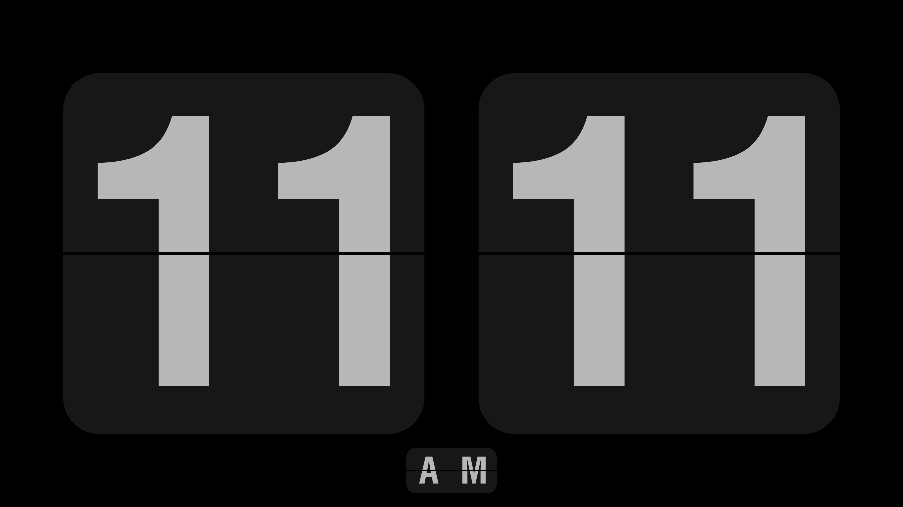

FlipClock
=========

A flip clock screensaver supported by SDL2.
-------------------------------------------

# Usage

## Linux/macOS:

1. Install sdl2, sdl2_ttf.
2. `mkdir build && cd build && cmake -DCMAKE_BUILD_TYPE=Debug .. && make`
3. `./bin/flipclock -f ./flipclock.ttf`

## Windows:

1. Install CMake, Visual Studio.
2. Download SDL2 and SDL2_ttf devel files and extract.
3. Open CMake GUI, select source as this project, then choose build path, press Configure and Finish.
4. When Configure failed, fill `SDL2_DIR` to where you extract SDL2 devel files, then press Configure again. When Configure failed again, fill `SDL2_TTF_DIR` to where you extract SDL2_ttf devel files, then press Configure again.
5. When Configure finished, press Generate, then press Open Project to open Visual Studio.
6. Select `Release`, and build.
7. Go to `bin\Release` under your build path, take `flipclock.exe` and put it into a folder with `SDL2.dll`, `SDL2_ttf.dll`, `libfreetype-6.dll` and `zlib1.dll`. You can find them in `lib\x64` (or `lib\x86` if you are using a 32-bit Windows) under where you extract SDL2 and SDL2_ttf devel files.
8. Go to your build path and right click `flipclock.ttf` and "install it for all users", or just copy it into `C:\Windows\Fonts`.
9. You can now run `flipclock.exe` or rename it into `flipclock.scr`, then right click it to install it as a screensaver.