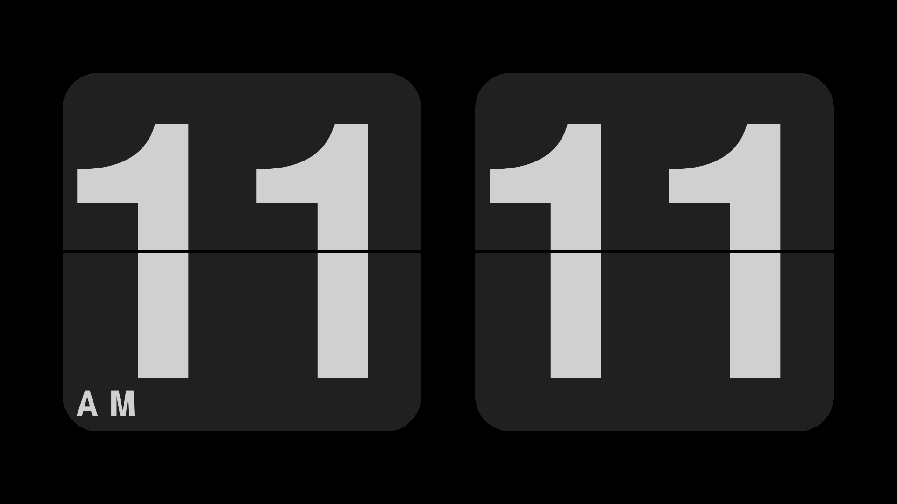

FlipClock
=========

A flip clock screensaver supported by SDL2.
-------------------------------------------

# Notice

I added multi-display support to this program, but adding/removing monitors while program is running is not supported, and you should not do this.

If you run this program in windowed mode (`-w`), only one display is supported. Multi-display is only supported in fullscreen mode.

# Usage

## Linux/macOS

### Packaged

- Arch Linux: You can install from [AUR](https://aur.archlinux.org/packages/flipclock/).

### From Source

#### With Meson (Recommended)

1. Install sdl2, sdl2_ttf.
2. `mkdir build && cd build && meson setup . .. && meson compile`
3. `./flipclock -f ../flipclock.ttf`
4. If you want to install this to your system, it is suggested to build with `mkdir build && cd build && meson setup --prefix=/usr . .. && meson compile && sudo meson install`.

#### With CMake

1. Install sdl2, sdl2_ttf.
2. `mkdir build && cd build && cmake -DCMAKE_BUILD_TYPE=Debug .. && make`
3. `./bin/flipclock -f ../flipclock.ttf`
4. If you want to install this to your system, it is suggested to build with `mkdir build && cd build && cmake -DCMAKE_INSTALL_PREFIX=/usr .. && make && sudo make install`.

## Windows

### Prebuilt

Just download file with `win` in its name from [lastest release page](https://github.com/AlynxZhou/flipclock/releases/latest), extract it and right click `flipclock.ttf` to "install it for all users", or just copy it into `C:\Windows\Fonts`. Then right click `flipclock.scr` to install it as a screensaver.

### From Source

1. Install CMake, Visual Studio.
2. Download SDL2 and SDL2_ttf devel files and extract.
3. Open CMake GUI, select source as this project, then choose build path, press Configure and Finish.
4. When Configure failed, set `CMAKE_INSTALL_PREFIX` to where you want to save all runtime files, fill `SDL2_DIR` to where you extract SDL2 devel files, then press Configure again. When Configure failed again, fill `SDL2_TTF_DIR` to where you extract SDL2_ttf devel files, then press Configure again.
5. When Configure finished, press Generate, then press Open Project to open Visual Studio.
6. Select `Release`, and right click `INSTALL` in the right panel, and build it.
8. Go to `flipclock` dir under your `CMAKE_INSTALL_PREFIX` and right click `flipclock.ttf` to "install it for all users", or just copy it into `C:\Windows\Fonts`.
9. You can now rename `flipclock.exe` to `flipclock.scr` and right click it to install it as a screensaver.

## Android

See [flipclock-android](https://github.com/AlynxZhou/flipclock-android/).

# License

[Apache-2.0](./LICENSE)
